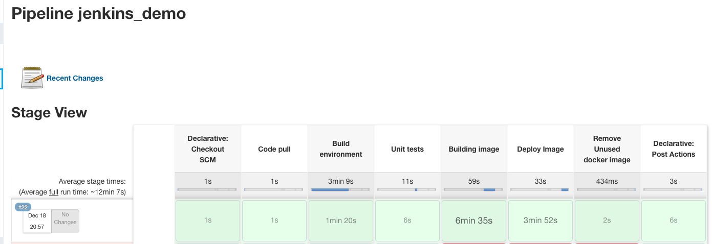

# Dockerize and deploy machine learning application on AWS
- A multi-class image classification use case
- Tools: Pytorch, ResNet, Flask, Unit test, EC2, Jenkins, Github
- work in progress

Step by step guide 

## Part 1: Develop model using transfer learning
0. Clone and setup environment

```
git clone https://github.com/valerielimyh/ml_deploy_aws.git
```

b. create a virtual environment, install the req and activate the venv

```
(assuming you're also using anaconda3's python) python -m venv <venvName>
pip install requirements.txt
source <venvName>/bin/activate
```

Images were downloaded from https://www.kaggle.com/clorichel/boat-types-recognition 

1. Create data folder strucutre 

```
python src/pytorch_data_prep.py  --jobname vl_test1 --original_data_dir 'data/raw/' --test_ratio 0.200000

python src/pytorch_data_prep.py  --jobname vl_testSmall1 --original_data_dir 'data/rawSmall/' --test_ratio 0.200000
```

2. Train

```
python src/train.py  --jobname vl_test_1 --new_data_dir 'data/processed' --result_base_dir 'src/output'  --epochs 50 --max_epochs_stop 10 --img_size 256 --cnn_sel 'resnet50' --batch_size 32

```


3. Inference

```
#small
python src/predict.py --jobname vl_blindTest --model_fn src/output/vl_test_1/resnet50-transfer.pth --test_dir data/processed/test --result_base_dir 'src/output' --img_size 256 

python src/predict.py --jobname vl_blindTestSmall --model_fn src/output/vl_testSmall_1/resnet50-transfer.pth --test_dir data/processedSmall/test --result_base_dir 'src/output' --img_size 256 

python src/predict.py --jobname vl_blindTest --model_fn src/output/vl_test_1/resnet50-transfer.pth --test_dir ./app/static/uploads/b_20201211_100510 --result_base_dir 'src/output' --img_size 256 
```

4. flask

```
python app/predictor.py
```

## Part 2: run docker image locally

5. Build the docker image (make sure you have docker running). 
It’s not mandatory to specify a tag name. The :latest tag is a default tag when build is run without a specific tag specified. explicitly tag your image after each build if you want to maintain a good version history.

```
docker build -t valerielimyh/ml_deploy_aws:1.0 .
```
- the “.” at the end of the command tells Docker to locate the Dockerfile in my current directory, which is my project folder. 

a. Use command ‘docker images’ to see a docker image with a docker repository named `ml_deploy_aws` created. (Another repository named python will also be seen since it is the base image on top of which we build our custom image.)

6. Now, the image is built and ready to be run locally

```
docker run --name cv-deploy -p 5000:5000 valerielimyh/ml_deploy_aws:1.0
```

(Optional) Clean up the container

```
docker rmi <dockerName>:<tag>
```

7. Push docker image to Docker Hub
a. If you’re doing this for the first time, you’ll have to log in to Docker Hub using the command below

```
docker login --username=<yourhubusername>
```

b. copy the IMAGE ID for that particular image and tag it

```
docker tag be0d6ed3471f valerielimyh/ml_deploy_aws:1.0
```

c. push your image to Docker Hub using the repository you created with the command

```
docker push valerielimyh/ml_deploy_aws
```

## Part 3: Run the Docker Image on the EC2 instance

7. ssh into your EC2 instance (I'm using  Amazon Linux AMI 2018.03.0 (HVM))
```
ssh -i ~/.ssh/yourpairkey.pem ec2-user@my-instance-public-dns-name
```

8. in your EC2 instance,  update your instance packages
```
sudo yum update
sudo yum install docker
```

9. After installation, pull the docker image we pushed to the repository.

```
docker pull valerielimyh/ml_deploy_aws:3.0
```

a. if you face this error `Cannot connect to the Docker daemon at unix:///var/run/docker.sock. Is the docker daemon running?`, resolve by doing
```
sudo service docker start
Then pull the image again.
```

10. Confirm image is downloaded by running
```
docker images
```

11. Run the docker image 
```
docker run --name cv-model-deploy -d -p 5000:5000 valerielimyh/ml_deploy_aws:3.0
```
-d option to create persistent docker container

You can test the API on your browser with the Public DNS for your instance 

(or you can pull the docker image for this repo from Docker Hub using)

```
docker pull valerielimyh/ml_deploy_aws:3.0
```

##### Flask demo can be found [here](https://youtu.be/eAlhw-Nu_CQ)

## Part 4: Install and Configure Jenkins
12. install java1.8 

```
sudo yum install java-1.8.0
```

13.  ensure that your software packages are up to date on your instance

```
sudo yum update –y
```

14. Add the Jenkins repo 

```
sudo wget -O /etc/yum.repos.d/jenkins.repo http://pkg.jenkins-ci.org/redhat/jenkins.repo
```

15.  Import a key file from Jenkins-CI to enable installation from the package

```
sudo rpm --import https://pkg.jenkins.io/redhat/jenkins.io.key 
```

16. Install Jenkins

```
sudo yum install jenkins -y
```

17. Change settings to JENKINS_USER="root"

```
sudo vim /etc/sysconfig/jenkins
(`i` to insert; `esc` + `:wq` to write and quit)
```

18. Start Jenkins as a service.

```
sudo service jenkins start
```

19. To start the jenkins service at boot-up

```
sudo systemctl enable jenkins.service
```

21. On browser, open the following link
http://<yourPublicDNS>:8080
- can be your server IP or public DNS at the above port to get the jenkins dashboard by making sure that the port is open i.e. you added the inbould rule for that port on your AMI server (default port 8080)

21. on server, copy the initial password to proceed with the installation
```
sudo cat /var/lib/jenkins/secrets/initialAdminPassword
```

22. On browser, 
a. install suggested plugins. 
b. Sign up your account. 
c. Save and go ahead. 
d. Go to ‘Jenkins management’

23. On EC2, install git; and check where it's installed
a. sudo yum install git
b. which git

24. Goto to -> Manage Jenkins -> Global Tool Configuration ->Git->Path to Git executable and copy the git executable path. Mine is `/usr/bin/git`

25. Follow [this guide](https://towardsdatascience.com/automating-data-science-projects-with-jenkins-8e843771aa02) to build Jenkins pipeline 

26. Jenkins does not see our nice system Miniconda installation. We will have to make Jenkins use proper python interpreter and create virtual environments accessible in the workspace of the project every time job is run. The best solution is to install Miniconda and manage environments from the jenkins user level. 

```
$ sudo su
# su - jenkins
# cd /var/lib/jenkins # go to jenkins $HOME dir
wget https://repo.continuum.io/miniconda/Miniconda3-latest-Linux-x86_64.sh
bash Miniconda3-latest-Linux-x86_64.sh -p /var/lib/jenkins/miniconda3

Miniconda3 will now be installed into this location:
/var/lib/jenkins/miniconda3

- Press ENTER to confirm the location
- Press CTRL-C to abort the installation
- Or specify a different location below

...
installation finished.
Do you wish the installer to prepend the Miniconda3 install location
to PATH in your /var/lib/jenkins/.bashrc ? [yes|no]
[no] >>>  #say no
```

## Part 5: Jenkins declarative pipeline config to run unit tests and build docker image
- Install the [Docker Pipelines plugin](https://docs.cloudbees.com/docs/admin-resources/latest/plugins/docker-workflow) on Jenkins:
Manage Jenkins → Manage Plugins.
Search Docker Pipelines, click on Install without restart 
- Follow remaining instructions on this [post](https://medium.com/faun/docker-build-push-with-declarative-pipeline-in-jenkins-2f12c2e43807) starting from `Create credentials on Jenkins for GitHub and docker hub` 

A successful run looks like this 


References

* [Guide on Jenkins anatomy](https://mdyzma.github.io/2017/10/14/python-app-and-jenkins/) 
* [Install and Configure Jenkins on AWS EC2](https://medium.com/@mohan08p/install-and-configure-jenkins-on-amazon-ami-8617f0816444) 
* [Managing Jenkins security settings](http://abhijitkakade.com/2019/06/how-to-reset-jenkins-admin-users-password/)


## Misc

### To pull docker image from registry as a non-root user 
[Reference](https://docs.docker.com/install/linux/linux-postinstall/#manage-docker-as-a-non-root-user)

- Create the docker group
```
sudo groupadd <docker-grp>
```

- Add your user to the docker group.
```
sudo usermod -aG <docker-grp> ${USER}
```

- You would need to log out and log back in so that your group membership is re-evaluated or type the following command:
```
sudo su ${USER}
```

- Check if you added the current user
```
getent group
```

- pull the docker image 

```
docker pull valerielimyh/ml_deploy_aws:2.0
```

### Access control for Flask 
- Currently using flask-htpasswd


### Troubleshooting 
when faced with `Got permission denied while trying to connect to the Docker daemon socket at unix:///var/run/docker.sock: Get xxx dial unix /var/run/docker.sock: connect: permission denied` while Jenkins declarative pipeline is building docker image
[Ref] (https://stackoverflow.com/questions/47854463/docker-got-permission-denied-while-trying-to-connect-to-the-docker-daemon-socke#answer-49364278)
The user jenkins needs to be added to the group docker:

```
$ sudo usermod -a -G docker jenkins
$ sudo su
# usermod -aG root jenkins
# chmod 777 /var/run/docker.sock
```

